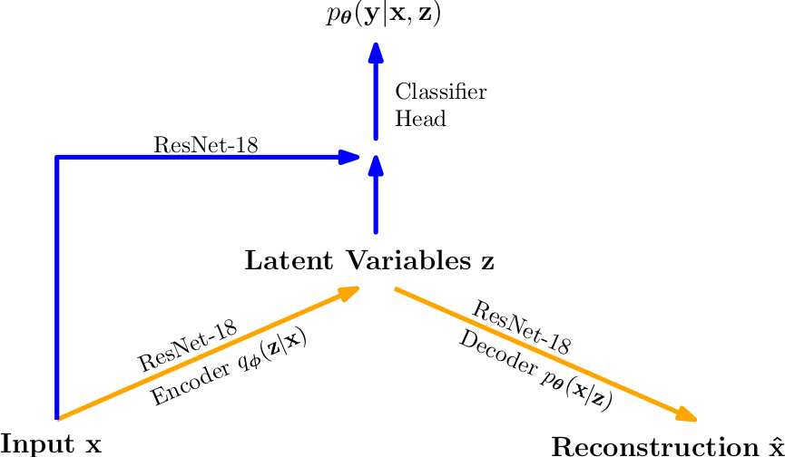

# Main references
* Hybrid Modeling: Ermon/Kuleshov http://www.cs.cornell.edu/~kuleshov/papers/uai2017.pdf 
* Out-Of-Distribution Detection via p(y|x): https://arxiv.org/abs/1610.02136
* Importance Weighted Autoencoder: https://arxiv.org/abs/1509.00519
* Expected Calibration Error: https://arxiv.org/abs/1706.04599
* Adversarial Robustness: https://arxiv.org/abs/1412.6572

# Abstract
In machine learning, probabilistic models are usually divided into discriminative and generative models. While the former often achieve higher accuracy on large datasets, the latter are designed to incorporate more extensive information. Moreover, the decision whether to use a discriminative or a generative model is a fundamental problem in large-scale applications due to safety-related aspects. To address this problem, we extend upon the results of [Kuleshov and Ermon (2017)](http://www.cs.cornell.edu/~kuleshov/papers/uai2017.pdf) and instantiate Hybrid Discriminative-Generative Models (HDGMs) with Residual Neural Networks (ResNets) and 𝛽-Variational Autoencoders (VAEs). The resulting Deep Hybrid Models (DHMs) are examined with respect to three robustness metrics relevant to safety, namely the Expected Calibration Error (ECE), the Out-Of-Distribution (OOD) detection, and the adversarial robustness in the context of the Fast Gradient Sign Method (FGSM). We show that DHMs achieve comparable results to supervised ResNets and unsupervised 𝛽-VAEs on well-known image recognition benchmark datasets, that is, Street View House Numbers (SVHN) and CIFAR-10. Furthermore, we demonstrate that DHMs are subject to the same problem as deep generative models in near-OOD detection tasks. This suggests that the multi-conditional objective of DHMs does not provide a solution to the problem of assigning higher likelihood values to near-OOD samples associated with deep generative models. And finally, we show that the ability of DHMs to interpolate between discriminative and generative approaches does not lead to significant improvements in ECE and adversarial robustness.

	

# Features: 
* Training Datasets: SVHN, CIFAR10
* Adversarial Robustness in the context of FGSM attacks
* OOD Datasets: SVHN, CIFAR100
* OOD Detection via max p(y|x) as in https://arxiv.org/abs/1610.02136 (using AUROC)
* OOD Detection via log p(x) (using AUROC)
* Customized VAE with forward hooks for feature level investigation
* Importance Weighted Autoencoders (IWAE) as in https://arxiv.org/abs/1509.00519
* Beta-VAE, see https://openreview.net/forum?id=Sy2fzU9gl
* Checkpoint loading of pretrained ResNet-Classifier with Head 
# Remark
The code was not intended for the public and was therefore not implemented according to specific coding standards.

